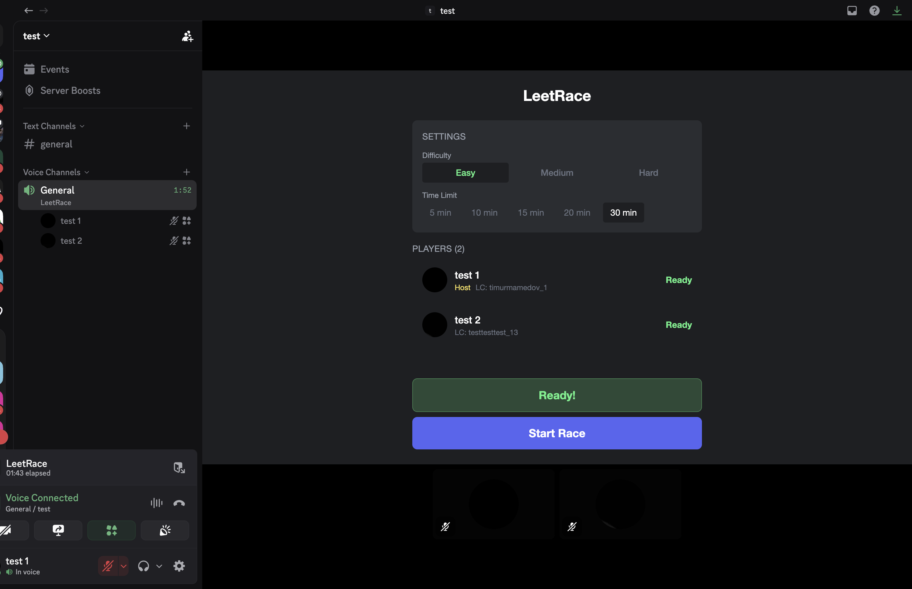
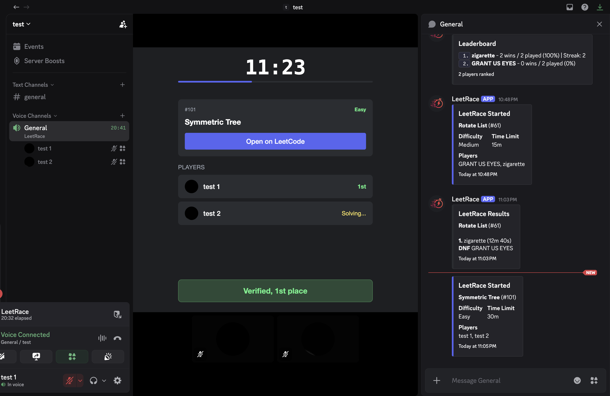
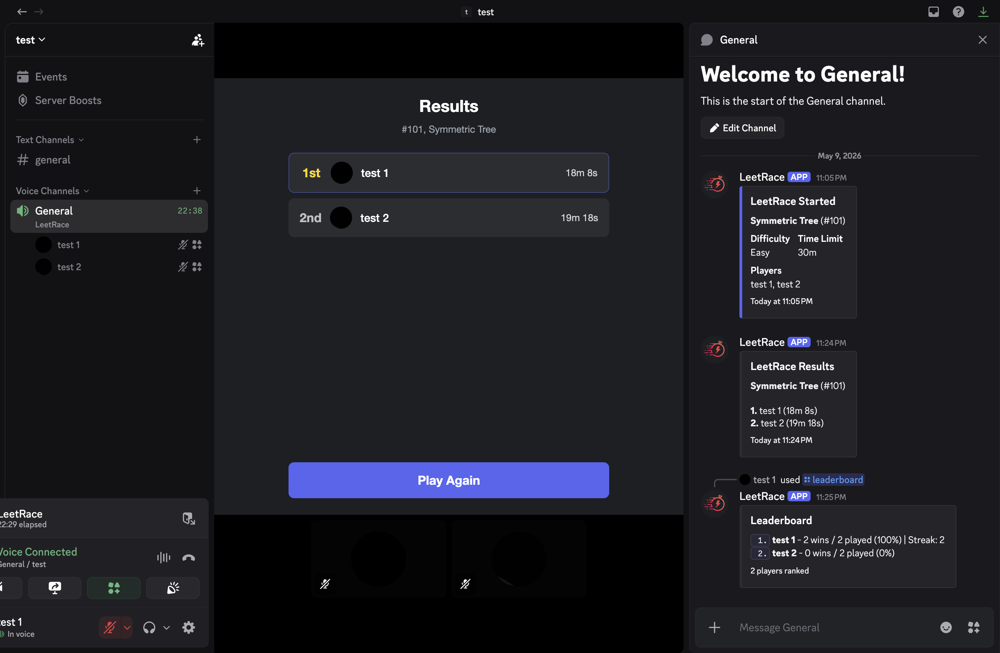

# LeetRace

A Discord activity that allows you to race your friends in solving LeetCode problems.

[Add LeetRace to your server](https://discord.com/oauth2/authorize?client_id=1498751992296771635)



## How It Works

1. Join a voice channel and launch LeetRace from the activity selection
2. Each player enters their LeetCode username, host chooses problem difficulty and time limit
3. Everyone readies up and the host starts the game
4. A random LeetCode problem is assigned from those of the chosen difficulty. Open it on LeetCode to solve it and hit submit
5. The server automatically verifies your solution by checking LeetCode submissions for the problem under your username
6. First player to solve it wins, consequent solutions are placed accordingly. Results and streaks are tracked per server (guild)





## Features

- **Multiplayer racing:** in any Discord voice channel via the Embedded App SDK
- **Automatic verification:** no URL pasting, the server checks your LeetCode submission history
- **Difficulty options:** (Easy, Medium, Hard) with configurable time limits (5–30 min)
- **Server stats:** wins, games played, win streaks tracked using SQLite
- **Server bot:** posts game started/results embeds to text chat
- **/leaderboard command:** displays top 10 players in your server
- **Automatic removal:** players who leave the voice channel are removed from the game

## Tech Stack

- **Frontend:** React, TypeScript, Vite, Tailwind CSS
- **Backend:** Node.js, Express, TypeScript
- **Database:** SQLite (better-sqlite3)
- **Bot:** discord.js v14
- **Activity SDK:** @discord/embedded-app-sdk

## Setup

### Prerequisites

- Node.js 20+
- A Discord application with the Activities feature enabled
- A bot token and client secret from the [Discord Developer Portal](https://discord.com/developers/applications)

### Environment Variables

Create a `.env` file in the root directory:

```
DISCORD_APP_ID=your_app_id
DISCORD_BOT_TOKEN=your_bot_token
DISCORD_CLIENT_SECRET=your_client_secret
VITE_DISCORD_APP_ID=your_app_id
```

### Installation

```bash
npm install
```

### Development

```bash
# Run both client and server
npm run dev

# Run only the client
npm run dev:client

# Run only the server
npm run dev:server
```

The client runs on port 5173 and the server on port 3001. Discord requires HTTPS even in development, so you need to use the Discord proxy URL or a Cloudflare tunnel (used by me in development).

### Production

```bash
npm run build
npm start
```

## Deployment

Deployed on [Railway](https://railway.com). Attach a volume mounted at `/app/data` to keep the SQLite database across deploys.